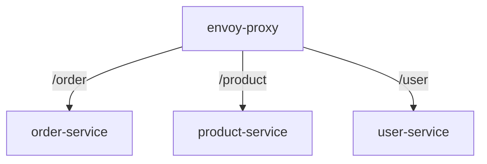

# Microservices with Envoy Proxy

This project is a simple microservices architecture implemented with [Envoy Proxy](https://www.envoyproxy.io/).



## Project Structure

- `envoy-proxy/`: Contains the Envoy Proxy configuration and deployment files.
- `order/`: Contains the order service. Request with ```/order``` will be forwarded to this service.
- `product/`: Contains the product service. Request with ```/product``` will be forwarded to this service.
- `user/`: Contains the user service. Request with ```/user``` will be forwarded to this service.

Each service is a NestJS application with a single endpoint that returns a message.


## Prerequisites
- Docker and Kubernetes are required to run the services.
- Helm is required to deploy the services.
- Node.js is required to run the deployment scripts.
- Docker Desktop's Kubernetes is used for local development.

## Setup

1. Deploy the services to a Kubernetes cluster:

Add permissions to the scripts:
```sh
chmod +x deploy.js
```

Deploy the services:
```sh
npm run deploy user
npm run deploy product
npm run deploy order
```

Check [deploy.js](deploy.js) for more details on how the deployment is done.

```js
const main = () => {
    try {
        process.chdir(serviceDir);
        execSync(`kubectl config use-context docker-desktop `, {stdio: 'inherit'});
        buildDockerImage();
        stopHelmRelease()
        helmInstall(serviceHelmDir);
        console.log(`${serviceName} service is up and running.`);
    } catch (error) {
        console.error(`Failed to run service ${serviceName}:`, error);
        process.exit(1);
    }
}
```


2. Deploy the Envoy Proxy:
```sh
helm install envoy-proxy ./envoy-proxy/helm
````

3. Access the services by port-forwarding the API Gateway service:
```sh
kubectl get pods
```
Use the pod name of the API Gateway service to port-forward:
```sh
kubectl port-forward <api-gateway-pod-name> 3000:3000
```

4. Access the services at the following URLs:

```sh
http://localhost:3000/user
http://localhost:3000/product
http://localhost:3000/order
```

The envoy configuration is in the `envoy-proxy/helm/templates/configmap.yaml` file.

```yaml
static_resources:
  listeners:
    - name: listener_0
      address:
        socket_address:
          address: 0.0.0.0
          port_value: 3000
      filter_chains:
        - filters:
            - name: envoy.filters.network.http_connection_manager
              typed_config:
                "@type": type.googleapis.com/envoy.extensions.filters.network.http_connection_manager.v3.HttpConnectionManager
                stat_prefix: ingress_http
                route_config:
                  name: local_route
                  virtual_hosts:
                    - name: backend
                      domains:
                        - "*"
                      routes:
                        - match:
                            prefix: "/order"
                          route:
                            cluster: order_service
                        - match:
                            prefix: "/product"
                          route:
                            cluster: product_service
                        - match:
                            prefix: "/user"
                          route:
                            cluster: user_service
                http_filters:
                  - name: envoy.filters.http.router
                    typed_config:
                      "@type": type.googleapis.com/envoy.extensions.filters.http.router.v3.Router
  clusters:
    - name: order_service
      connect_timeout: 0.25s
      type: strict_dns
      lb_policy: round_robin
      load_assignment:
        cluster_name: order_service
        endpoints:
          - lb_endpoints:
              - endpoint:
                  address:
                    socket_address:
                      address: order.default.svc.cluster.local
                      port_value: 80
    - name: product_service
      connect_timeout: 0.25s
      type: strict_dns
      lb_policy: round_robin
      load_assignment:
        cluster_name: product_service
        endpoints:
          - lb_endpoints:
              - endpoint:
                  address:
                    socket_address:
                      address: product.default.svc.cluster.local
                      port_value: 80
    - name: user_service
      connect_timeout: 0.25s
      type: strict_dns
      lb_policy: round_robin
      load_assignment:
        cluster_name: user_service
        endpoints:
          - lb_endpoints:
              - endpoint:
                  address:
                    socket_address:
                      address: user.default.svc.cluster.local
                      port_value: 80
```


